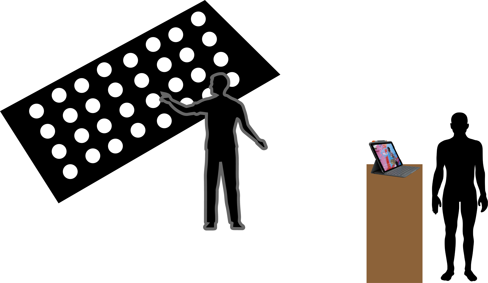
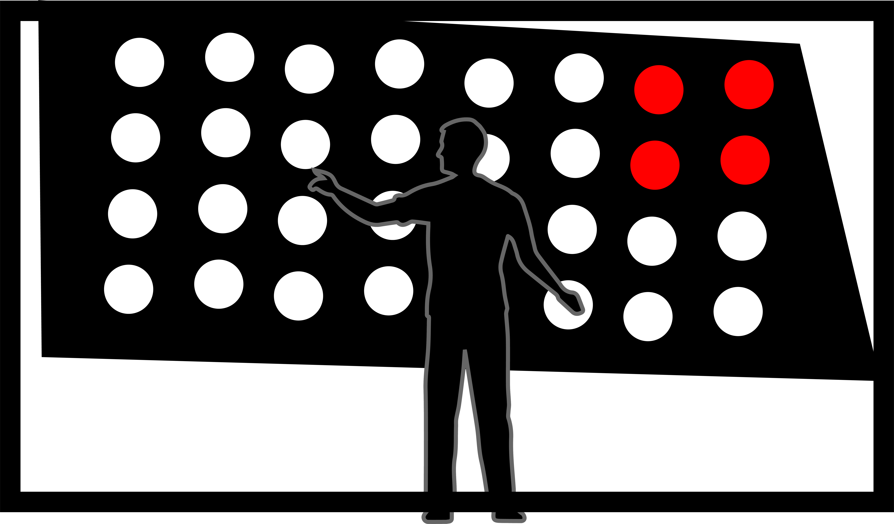

# Présentation d'une idée

### Concept

Capter la chaleur grâce à une caméra thermique.

Quand le capteur détecte une forte chaleur, il allume les lumières.

Ainsi, la silouhette de la personne ou bien simplement la partie proche des lumières s'allumera.

Lorsque les mouvement s'accélère les lumières commencent à clignoter.

De plus en plus vite en fonction du mouvement.

Pendant ce temps, une personne dirige la personne devant les lumières grâcent à une retransmission de la caméra.

Un jeu avec la retransmission apparaît sur une tablette.

Les deux personnes devront donc communiquer afin de finir le mini jeu.

Le mini jeu rajoutera des bruits constants un après l'autre lorsque les points sont récoltés.

Tout dans le but de déstabiliser les joueurs (bruit, lumière qui apparaît et qui clignote)

#### Matériel
Ordinateur

Lumière

Kinect

Unity

M5 thermal camera / caméra thermique

### Réalisation

Détecter la chaleur afin de faire allumer les lumières simplement lorsque la chaleur est forte

Relier les lumière à la caméra thermique

Transmettre le flux d'une caméra à un ipad grâce à une kinect

Faire un mini jeu intégrant le flux vidéo grâce à unity

Rendre le mini jeu interactif

Synchroniser pour que le jeu garde le son lorsque la pastille est touché

Faire apparaître des instructions afin de rendre la compréhension plus clair

