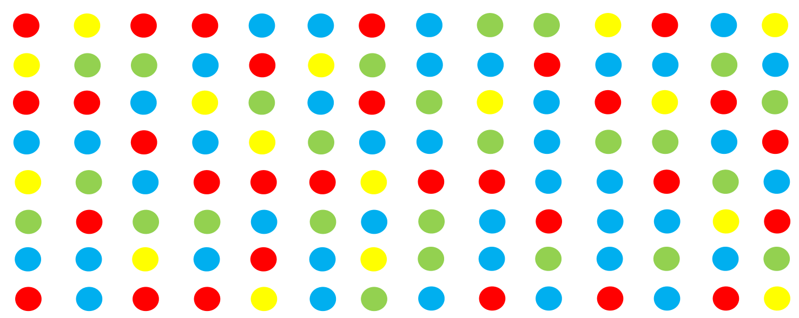
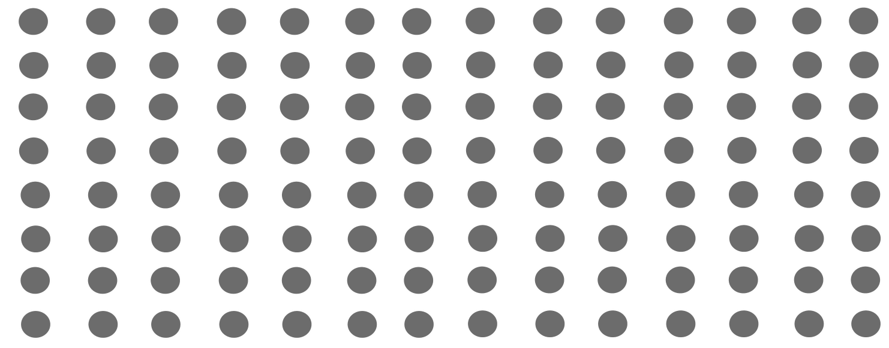
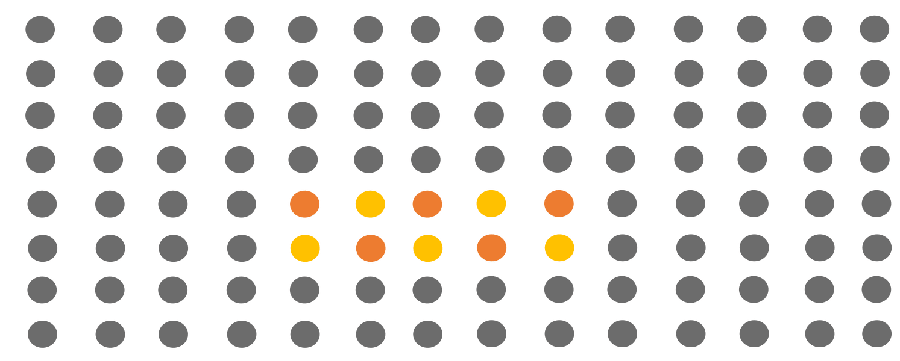

# Présentation d'une idée
## Détection de mouvement

### Concept
Capter le mouvement grâce à des capteurs

Synchroniser le mouvement avec les lumières

#### Aucun visiteur

Les lumières scintillent de manière aléatoire
#### Quelqu'un s'approche 
Les lumière s'éteignent

#### Passe devant les lumières
Les lumières suivent le mouvement de la main de la personne

Illumine simplement la partie où l'interacteur est présent

Faire fonctionner le système avec plusieurs personnes

