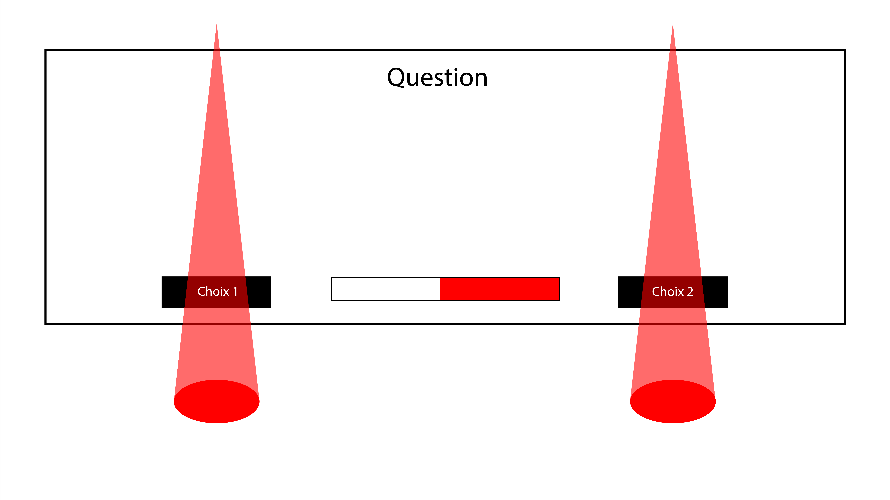

Élaborer réellement une histoire, les choix, pourquoi on fait un choix, c'est quoi l'histoire, la recherche, l'expérience

# Présentation d'une idée

## Concept général 
Histoire interactive

L'interacteur vient faire les choix pour avancer dans l'histoire

Son choix impacte l'histoire

Plusieurs fins sont possible

Projection à la fois sur les murs et sur le sol

## Thème/Scripts
Venir faire réaliser aux gens que chaque décision a un impact

Que la décision soit minuscule ou grande, elles ont toujours un impact

Qu'il n'y a pas de bonne ou de mauvaise décision simplement nos décisions

On vient se rendre compte que l'on fait constamment des choix

## Inspirations 
### Conceptuelles 
16 min. [Detroit Become Human](https://www.youtube.com/watch?v=t3cLDDwLeJA)

[Black Mirror: Bandersnatch](https://www.youtube.com/watch?v=VNw9DAwp2Kk)

### Artistique / esthétique  
[Imagine Monet](https://artipelag.se/en/at-artipelag/imagine-monet-the-immersive-exhibition/)

[KONTINUUM](https://www.youtube.com/watch?v=J0eAyYpBJnw&t=89s)

[Oasis immersion](https://www.youtube.com/watch?v=FmGiMxb89Jg)

### Technique / technologique  
[Interactive Basketball Court](https://www.youtube.com/watch?v=LPBqB9O0gPo)

## Concept spécifique  

Mélange de projection vidéo et de jeu de lumières

Histoire projeter sur les murs en face de l'interacteur

Projection de visuelle qui suit l'histoire sur le sol

Lumière qui suit également l'histoire

Un stand permet de voir les choix à faire

Lors du choix toutes les lumières s'éteignent et 2 halo de lumière apparaissent

Ce qui invite l'interacteur à venir se placer entre 2 halo de lumière qui représente chacun une décision

Objet interactif permet également de faire un choix

L'objet vient sortir à une séquence précise et invite l'intéracteur a faire un choix

A utiliser ou non l'objet

## Expérience générale

## Moment de faire le choix

## Application du film interactif

## Reconnaissance de limites / défis 

### Qu’est-ce qui va être difficile, et comment cela sera réalisé 

L'objet interactif = arduino + objets

Projection visuelle + lumière = Madmapper 

Relié le tous = Max

Garder une continuité dans l'histoire = Coupure de plan, changer de plan, enchainement fluide

